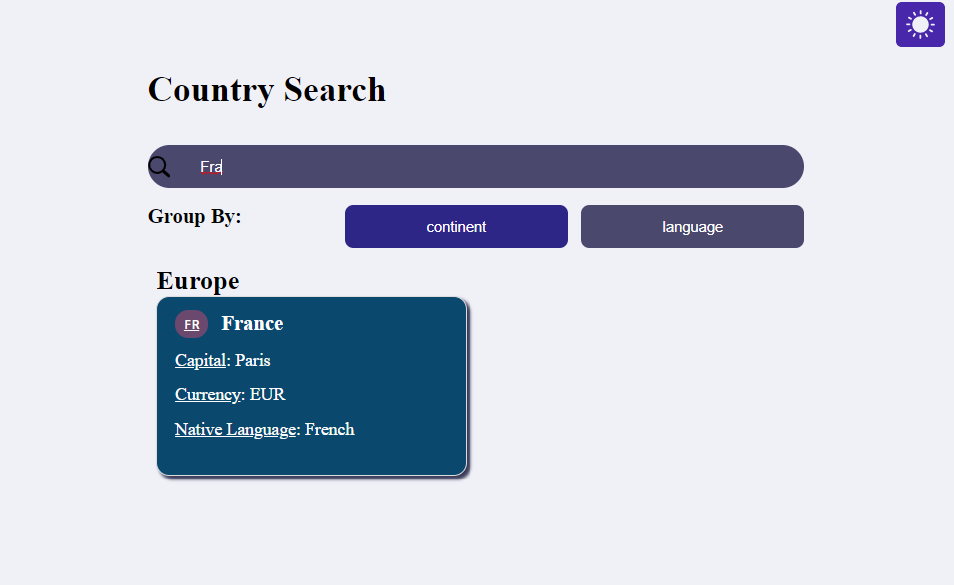
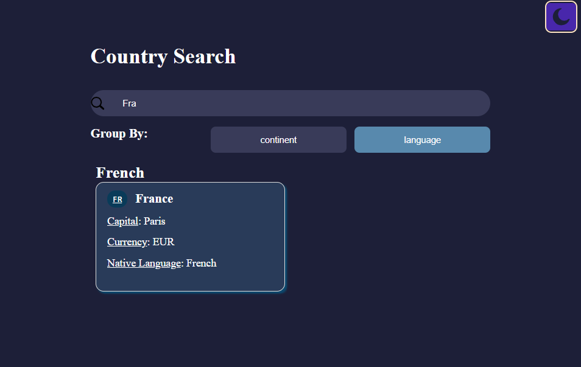

# Desafío para Software Engineers

## Nombre postulante: [Ignacio Fedorenco](https://ignfed.vercel.app/)

# Preview:

# Dato:

Hola, agregué el boton de cambio de tema porque me parece que hoy en día absolutamente todo sitio debería de tener la opción de cambiar de modo al alcance. A mi, por ejemplo, y seguramente a muchos más, les parece más comodo visualmente o estéticamente mejor el modo oscuro. Mientras que a otros no les molesta.

## Deploy hecho con Vercel: [Sitio Web](https://kimche-challenge-phi.vercel.app/)

## Respuesta a la pregunta sobre base de datos [aquí](./kimchechallenge/README.md)
